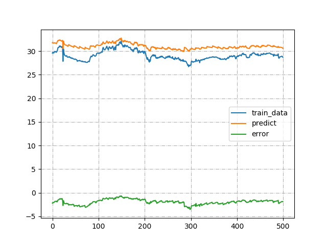

# LSTM temperature predict
A test for LSTM matchine learning.


## Data prepration
Here is the sample data
```
temperature,humidity,pressure,log_date
25.55,38.3144,1014.9,2019-04-12 17:20:09
25.53,38.2939,1014.92,2019-04-12 17:25:08
25.51,38.2715,1014.85,2019-04-12 17:30:10
25.32,37.2812,1014.51,2019-04-12 17:35:08
25.5,37.5977,1014.87,2019-04-12 17:40:09
```

## Usage
1. Use `data_prep.py` to generate training data.
2. Use `trainer.py` to train the model.
3. Run `tensorboard --logdir=logs` to analyze run log.
4. Use `data_plot.py` to verify the predict.